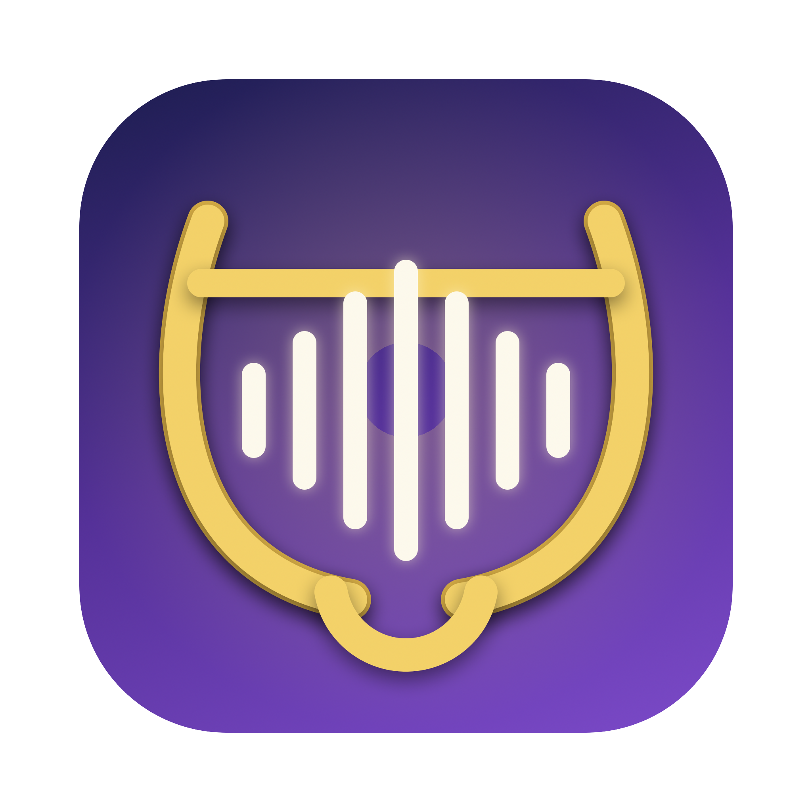

<p align="center">
  
</p>

<h1 align="center">Whispr Free Me</h1>

<p align="center">
  Free and open source alternative to <a href="https://wisprflow.ai">Wispr Flow</a>, <a href="https://superwhisper.com">Superwhisper</a>, and <a href="https://monologue.to">Monologue</a>.
</p>

<p align="center">
  A fork of <a href="https://github.com/zachlatta/freeflow">FreeFlow</a> that adds a local, opt-in <b>Voice Bank</b> — and, on the roadmap, cloud voice cloning and system-wide "speak as me". See <a href="docs/superpowers/specs/2026-06-08-whispr-free-me-design.md">the design doc</a>.
</p>

<p align="center">
  <a href="https://github.com/zachlatta/freeflow/releases/latest/download/FreeFlow.dmg"><b>⬇ Download FreeFlow.dmg</b></a><br>
  <sub>Works on all Macs (Apple Silicon + Intel)</sub>
</p>

---

<p align="center">
  
</p>

<p align="center">
  <i>Thank you to <a href="https://github.com/marcbodea">@marcbodea</a> for maintaining FreeFlow!</i>
</p>

## Overview

FreeFlow is a free Mac dictation app inspired by [Wispr Flow](https://wisprflow.ai/), [Superwhisper](https://superwhisper.com/), and [Monologue](https://www.monologue.to/). It gives you fast AI transcription, context-aware cleanup, and voice-driven text editing without a monthly subscription.

## Quick Start

1. Download the app from above or [click here](https://github.com/zachlatta/freeflow/releases/latest/download/FreeFlow.dmg)
2. Get a free Groq API key from [groq.com](https://groq.com/)
3. Hold `Fn` to talk, or tap `Command-Fn` to start and stop dictation, and have whatever you say pasted into the current text field

## Features

- **Voice Bank (opt-in):** Off by default. When you turn it on, Whispr Free Me keeps a local copy of each dictation's audio and exact transcript to build a voice-training dataset. Nothing is uploaded; browse and delete it in Settings → Voice Bank.
- **Custom shortcuts:** Customize both hold-to-talk and toggle dictation shortcuts. If your toggle shortcut extends your hold shortcut, you can start in hold mode and press the extra modifier keys to latch into tap mode without stopping the recording.
- **Context-aware cleanup:** FreeFlow can read nearby app context so names, terms, and phrases are spelled correctly when you dictate into email, terminals, docs, and other apps.
- **Custom vocabulary:** Add names, jargon, and project-specific words that FreeFlow should preserve during cleanup.
- **OpenAI-compatible providers:** Use Groq by default, or configure a custom model and API URL in settings.

## Edit Mode

Edit Mode lets you highlight existing text and transform it with a spoken instruction, like "make this shorter" or "turn this into bullets." Enable it in settings, then use your normal dictation shortcut on selected text, or choose Manual mode to require an extra modifier key.

## Voice Bank

The Voice Bank is an opt-in feature that builds a personal voice-training dataset as you dictate. It is **off by default**.

When enabled (Settings → Voice Bank), each completed dictation has its audio (a 16 kHz mono WAV) and its exact spoken transcript saved locally to `~/Library/Application Support/Whispr Free Me/VoiceBank/`. A quality gate skips silent, very short, or non-dictation clips. The data is stored in its own database, independent of the run-history limit, so it is never trimmed away.

**Nothing is uploaded.** The Voice Bank only writes to your Mac. You can see how much you've banked, play back samples, and delete individual clips or everything at once, all from Settings → Voice Bank. A menu-bar indicator shows when banking is active.

This dataset is the foundation for upcoming cloud voice cloning and a system-wide "speak as me" feature; uploading anything off-device will always be a separate, explicit action.

## Privacy

There is no Whispr Free Me server, so by default Whispr Free Me does not store or retain your data. The only information that leaves your computer are API calls to your configured transcription and LLM provider.

The optional **Voice Bank** (off by default) is the one feature that stores data, and it stores it **locally only** — see the section above. Turning it on does not send anything off-device.

## Custom Cleanup

If you'd rather keep cleanup more literal and less context-aware, you can paste this simpler prompt into the custom system prompt setting:

<details>
  <summary>Simple post-processing prompt</summary>

  <pre><code>You are a dictation post-processor. You receive raw speech-to-text output and return clean text ready to be typed into an application.

Your job:
- Remove filler words (um, uh, you know, like) unless they carry meaning.
- Fix spelling, grammar, and punctuation errors.
- When the transcript already contains a word that is a close misspelling of a name or term from the context or custom vocabulary, correct the spelling. Never insert names or terms from context that the speaker did not say.
- Preserve the speaker's intent, tone, and meaning exactly.

Output rules:
- Return ONLY the cleaned transcript text, nothing else. So NEVER output words like "Here is the cleaned transcript text:"
- If the transcription is empty, return exactly: EMPTY
- Do not add words, names, or content that are not in the transcription. The context is only for correcting spelling of words already spoken.
- Do not change the meaning of what was said.

Example:
RAW_TRANSCRIPTION: "hey um so i just wanted to like follow up on the meating from yesterday i think we should definately move the dedline to next friday becuz the desine team still needs more time to finish the mock ups and um yeah let me know if that works for you ok thanks"

Then your response would be ONLY the cleaned up text, so here your response is ONLY:
"Hey, I just wanted to follow up on the meeting from yesterday. I think we should definitely move the deadline to next Friday because the design team still needs more time to finish the mockups. Let me know if that works for you. Thanks."</code></pre>
</details>

## Using a Local Model

FreeFlow can use OpenAI-compatible local or self-hosted providers instead of Groq. In settings, configure the API base URL and model IDs for your local LLM provider, such as Ollama, LM Studio, or another OpenAI-compatible server. If your transcription backend uses a different endpoint from your LLM backend, set the transcription API URL separately.

Local models are often slower than hosted providers, especially on cold start, long recordings, or busy hardware.

<details>
  <summary>Configure longer timeouts for local models</summary>

  FreeFlow keeps the default network timeout at 20 seconds, but you can extend it with macOS defaults:

```bash
defaults write com.zachlatta.freeflow transcription_timeout_seconds -float 120
defaults write com.zachlatta.freeflow post_processing_timeout_seconds -float 120
defaults write com.zachlatta.freeflow context_request_timeout_seconds -float 120
```

The timeout keys are:

- `transcription_timeout_seconds`: audio transcription requests
- `post_processing_timeout_seconds`: transcript cleanup and edit mode requests
- `context_request_timeout_seconds`: nearby app context requests

Only positive values are used. Remove a custom timeout to return to the 20-second default:

```bash
defaults delete com.zachlatta.freeflow transcription_timeout_seconds
defaults delete com.zachlatta.freeflow post_processing_timeout_seconds
defaults delete com.zachlatta.freeflow context_request_timeout_seconds
```

</details>

## License

Licensed under the MIT license.
